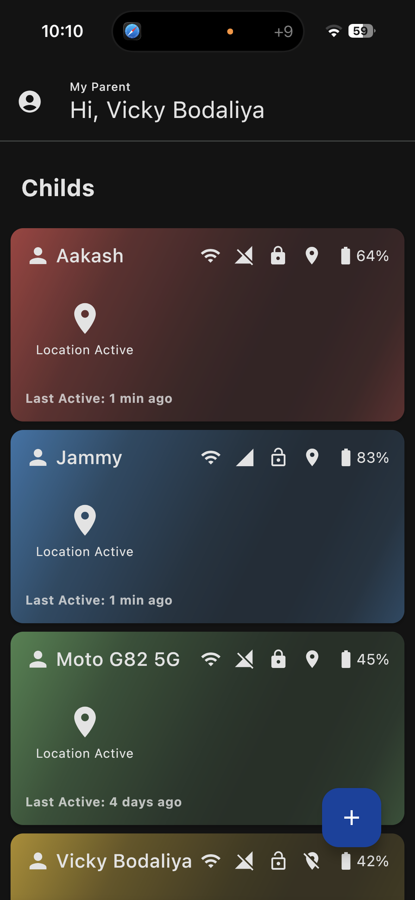
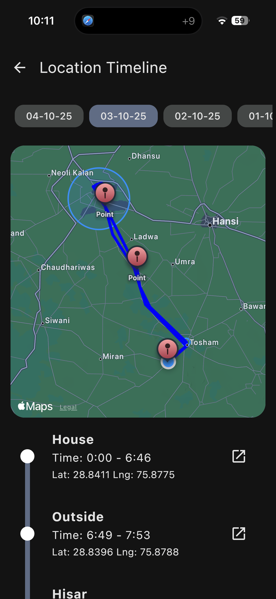
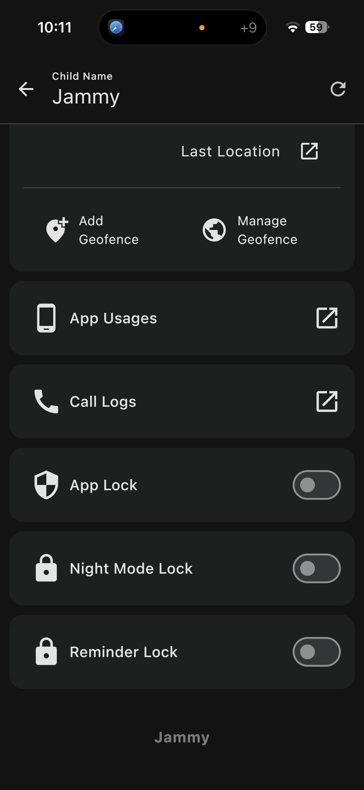

# Parent-Child Control App

A parent-child control mobile application for advanced device management, real-time location tracking, app usage monitoring, and digital wellbeing.

---

## 📱 Project Overview

The **Parent-Child Control App** is a secure and scalable parental control solution that allows parents to remotely monitor, restrict, and manage their child’s smartphone usage.

The system follows a **two-application architecture**:
- **Parent App** – Used to monitor and control child devices
- **Child App** – Installed on the child’s Android device with system-level permissions

> 🔒 This repository is a **project showcase only**.  
> Source code is not shared due to client confidentiality.

---

## 🧩 Application Architecture

### Parent Application
- Built using **Kotlin Multiplatform (KMP)**
- UI developed with **Compose Multiplatform**
- Supported Platforms:
  - Android
  - iOS

### Child Application
- Native **Android application**
- Built with:
  - Kotlin
  - Jetpack Compose
  - XML (system-level screens)

### Backend Infrastructure
- Firebase Authentication
- Firebase Firestore (real-time sync)
- Firebase Storage (media & image handling)

---

## 🔐 Core Functional Features

### 🔒 Device Lock & Remote Control
- Parent can remotely lock/unlock the child device
- When locked, the child **cannot access any apps or system features**
- Lock persists until parent disables it

---

### 📍 Real-Time Location Tracking
- Continuous location tracking (second/minute based)
- Live location updates on parent dashboard
- Location history maintained for **last 7 days**
- Polyline/route tracking for movement visualization

---

### 🗺️ Geofencing System
- Define safe zones (school, home, college)
- Automatic detection when child:
  - Enters the geofence
  - Exits the geofence
- Real-time alerts to parent device

---

### 📊 App Usage Monitoring & App Lock
- Monitor installed applications
- Track real-time app usage duration
- Lock specific apps (social media, games, etc.)
- Restrict background usage

---

### 📞 Call Activity Monitoring
- Track incoming and outgoing calls
- Secure access to call metadata
- Logs synced to parent dashboard

---

### ⏰ Scheduled Usage & School Mode
- Time-based device access control
- Example:
  - Device usable only between **3–6 hours**
- Outside scheduled hours:
  - Device automatically locks
- Ideal for school/college usage control

---

### 📟 Device Status Dashboard
- Battery level monitoring
- Device lock status
- Location sync status
- Online / offline state

---

### 👨‍👩‍👧 Multi-Child Management
- Single parent account can manage multiple children
- Independent rules and tracking per child device

---

## 🛡️ Advanced Permissions & Security (Technical)

The **Child App** operates using system-level permissions to ensure reliability and prevent misuse.

### 🔑 Accessibility Service
- Prevents child from:
  - Force-stopping the app
  - Uninstalling the app
- Enables app usage tracking
- Monitors foreground applications in real-time

---

### 🛠️ Device Admin Permission
- Required for:
  - Remote device lock
  - Enforcing security policies
- Ensures device control even after reboot

---

### 🪟 Appear on Top (Overlay Permission)
- Used to:
  - Block access when device is locked
  - Display lock screen overlay
- Prevents bypassing restrictions

---

### 📍 Location Permissions
- Foreground & background location access
- Required for:
  - Real-time tracking
  - Geofencing
  - Route history
- Works even when app is running in background

---

### 🔋 Battery Optimization Exclusion
- Prevents system from killing the child app
- Ensures continuous tracking and monitoring

---

### 🔐 App Persistence & Protection
- Child cannot uninstall the app manually
- App automatically restarts after reboot
- Restricted access to system settings

---

## 🖼️ Application Screenshots

> Screenshots stored inside the **screenshots/** directory

---

## 🛠️ Technology Stack

| Category | Technologies |
|--------|--------------|
| Languages | Kotlin, Java |
| Android UI | Jetpack Compose, XML |
| Multiplatform | Kotlin Multiplatform (KMP) |
| Backend | Firebase Auth, Firestore, Storage |
| Tools | Android Studio, Xcode |
| Architecture | MVVM, Clean Architecture |

---

## 📦 Demo APKs (Optional)

> APKs are stored in the **apks/** directory

- Parent App (Android)
- Child App (Android)

*(Demo builds only – not production)*

---

## ⚠️ Disclaimer

This repository is for **portfolio and showcase purposes only**.  
Source code and internal logic are private due to client confidentiality.

---

## 📬 Contact

For project discussions, technical collaboration, or similar solutions, feel free to connect with me on LinkedIn.
