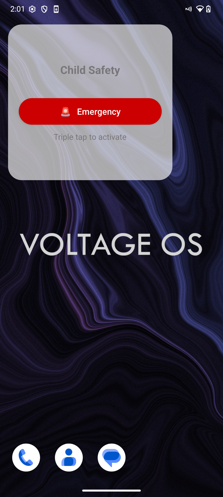
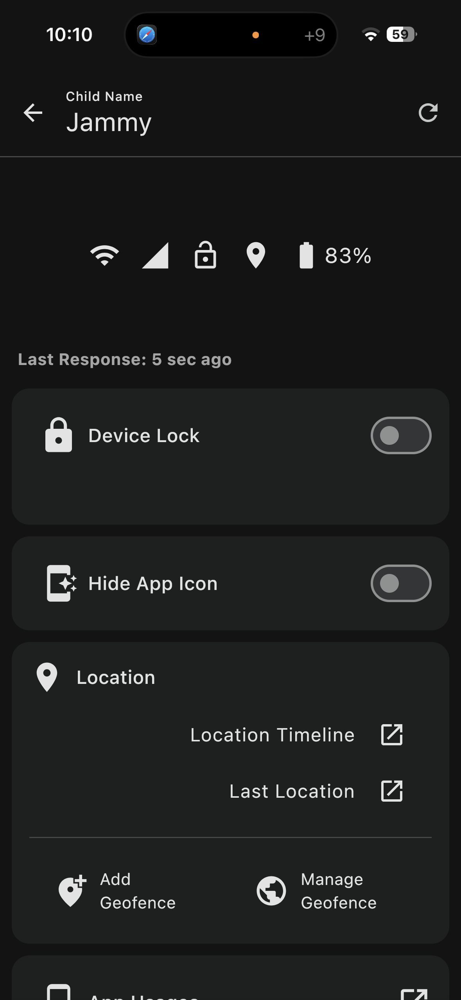
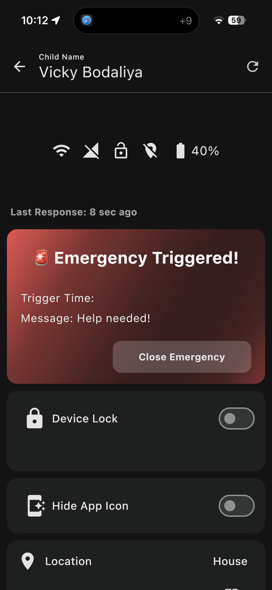
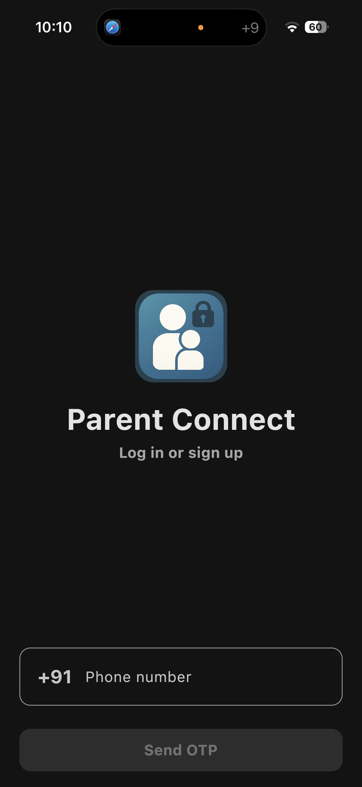

# Parent-Child Control App

A parent-child control mobile application designed to help parents monitor, manage, and secure their child’s smartphone usage while promoting digital wellbeing.

---

## 📱 Project Overview

The **Parent-Child Control App** is a two-part mobile solution that enables parents to remotely control and monitor their child’s device.

The system consists of:
- **Parent App** – Used by parents to control and monitor
- **Child App** – Installed on the child’s Android device

This project focuses on **device security, location safety, app usage control, and time-based restrictions**.

> ⚠️ This repository is a **project showcase only**.  
> Source code is not shared due to client confidentiality.

---

## 🧩 App Architecture

- **Parent App**
  - Built using **Kotlin Multiplatform (KMP)**
  - Developed with **Compose Multiplatform**
  - Available for **Android & iOS**

- **Child App**
  - Native **Android application**
  - Built using **Kotlin, Jetpack Compose, and XML**

- **Backend**
  - Firebase Authentication
  - Firebase Firestore (real-time data)
  - Firebase Storage (images & media)

---

## 🔐 Core Features

### 1️⃣ Device Lock & Control
- Remotely lock or unlock the child’s device
- Device remains locked until parent unlocks it
- Night mode restrictions to prevent device usage during sleep hours

---

### 2️⃣ Real-Time Location Tracking
- Location tracking every second/minute
- Live location updates on parent dashboard
- Location history available for last **7 days**

---

### 3️⃣ Geofencing
- Set safe zones (school, home, college)
- Automatic alerts when child:
  - Enters the geofence
  - Exits the geofence

---

### 4️⃣ App Usage Monitoring & App Lock
- View installed and used apps
- Monitor app usage duration
- Lock specific apps (social media, games, etc.)

---

### 5️⃣ Call Monitoring
- View incoming and outgoing call logs
- Track call activity securely

---

### 6️⃣ Scheduled Usage & School Mode
- Schedule allowed usage time (example: 3–6 hours)
- Automatically lock device outside allowed hours
- Useful during school or college timings

---

### 7️⃣ Device Status Dashboard
- Battery level monitoring
- Device lock status
- Location status
- Online/offline device state

---

### 8️⃣ Multi-Child Support
- Add and manage multiple child devices
- Centralized parent dashboard

---

## 🖼️ Screenshots

> 📌 Screenshots are stored in the **screenshots/** folder

```markdown






